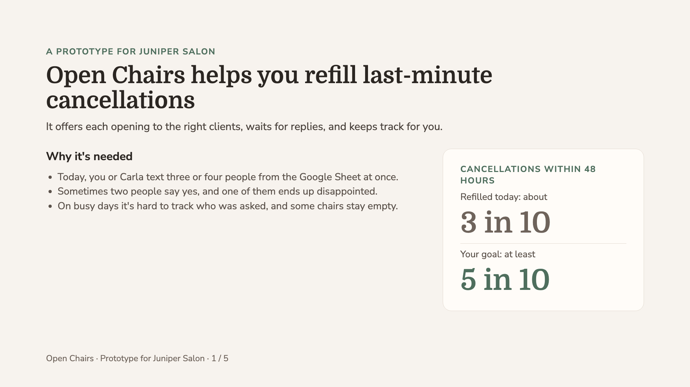
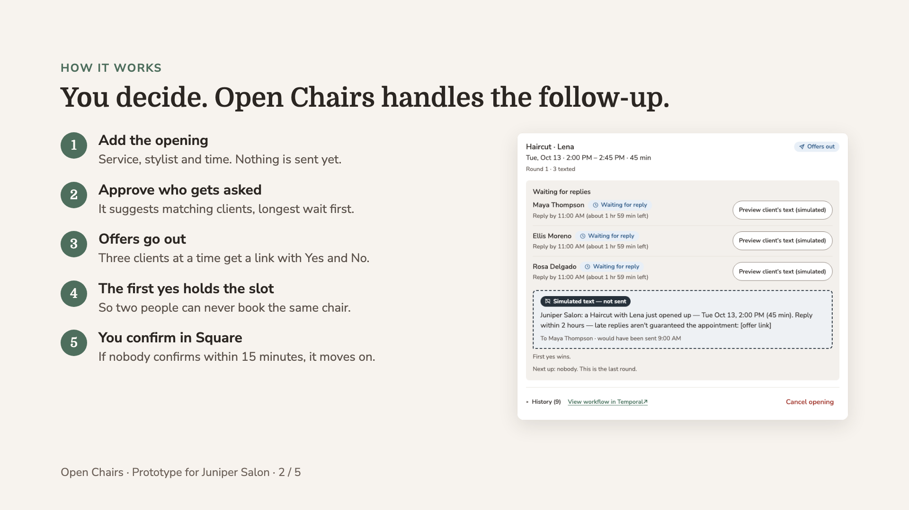
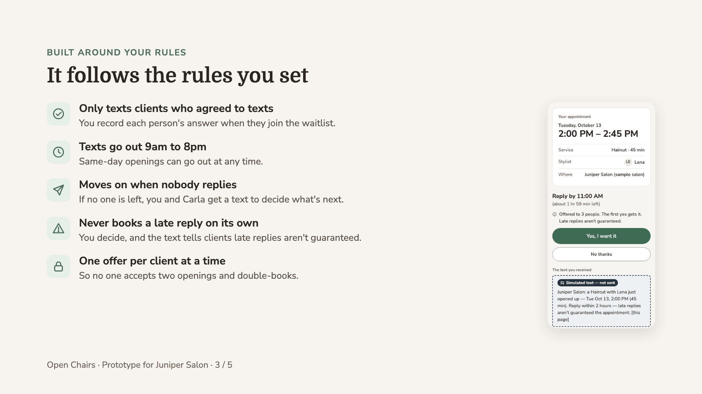
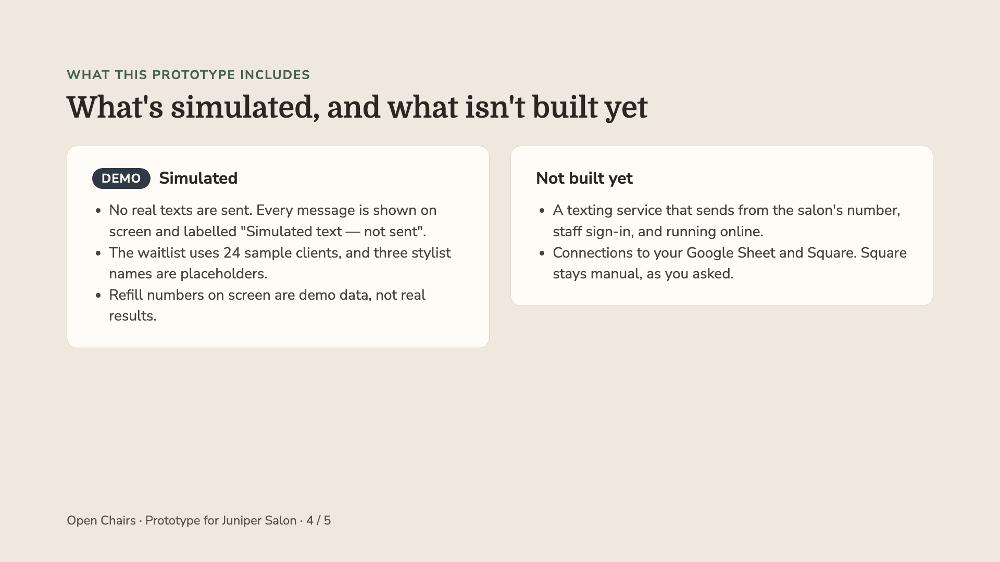
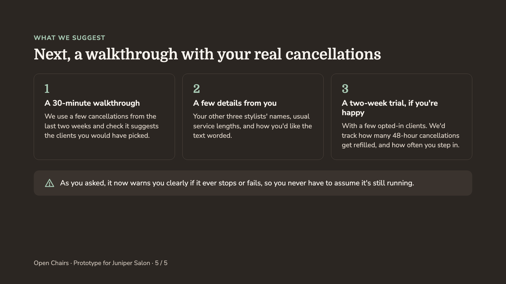

# Open Chairs — speaker notes

Script for presenting the deck to Lena (about 4–5 minutes, leaving time for the demo). The slides are in `Open-Chairs-Juniper-Salon.pdf`, with each slide as an image in `slides/`.

## 1. Open Chairs helps you refill last-minute cancellations

This is Open Chairs, a prototype we built for Juniper Salon. Its job is simple: when a client cancels at the last minute, it offers the slot to the right people on your waitlist, waits for their replies, and keeps track of everything so you and Carla don't have to. Today you text three or four people at once from the Google Sheet. That's quick, but sometimes two people say yes, and on busy days it's hard to keep track. Right now about three in ten cancellations made within 48 hours get refilled. Your goal is at least half.

## 2. You decide. Open Chairs handles the follow-up.

Here's how an opening gets filled. You add it: the service, the stylist and the time. Nothing goes out until you approve who gets asked; it suggests clients who match, with whoever has waited longest at the top. Then three clients at a time get a text with a link and Yes and No buttons. The first yes holds the slot, so two people can never end up booked into the same chair. You confirm with that client and update Square yourselves. If nobody confirms within 15 minutes, the hold is released and it moves on. On the right is what you see on screen: who has the offer, when they need to reply by, and the exact text they were sent.

## 3. It follows the rules you set

Everything on this slide came from you. It only texts clients who've agreed to texts, and you record that when they join. Texts go out between 9am and 8pm, except for same-day openings. If nobody replies, it moves on to the next people by itself, and you and Carla only get a text if no one is left. A late reply is never booked automatically; you decide, and the text already tells clients that late replies aren't guaranteed. And a client is only ever offered one opening at a time, so nobody ends up booked twice. On the right is what a client sees on their phone when they open the link.

## 4. What's simulated, and what isn't built yet

I want to be clear about what's real. Open Chairs is a working prototype, not a live service. No real texts are sent: every message is shown on screen with a "Simulated text — not sent" label, as you asked. The clients are sample data, three of the stylist names are placeholders, and the refill numbers come from the demo. What isn't built yet is everything needed for real clients: a texting service on the salon's number, a sign-in for you and Carla, and putting it online. It doesn't connect to your Google Sheet or Square. Square staying manual was your call.

## 5. Next, a walkthrough with your real cancellations

You said you'd like to see it working before any pilot, so that's where we'd start. First, a 30-minute walkthrough using a few of your real cancellations from the last two weeks, to check it suggests the clients you would have picked. Second, a few details from you: the other stylists' names, your usual service lengths, and how you'd like the text worded. Then, only if you're happy, a two-week trial with a few clients who've opted in, where we'd track how many 48-hour cancellations get refilled and how often you had to step in. And as you asked, it now warns you clearly if it ever stops or fails, so you and Carla never have to assume it's still running. Does that sound like a good place to start?
